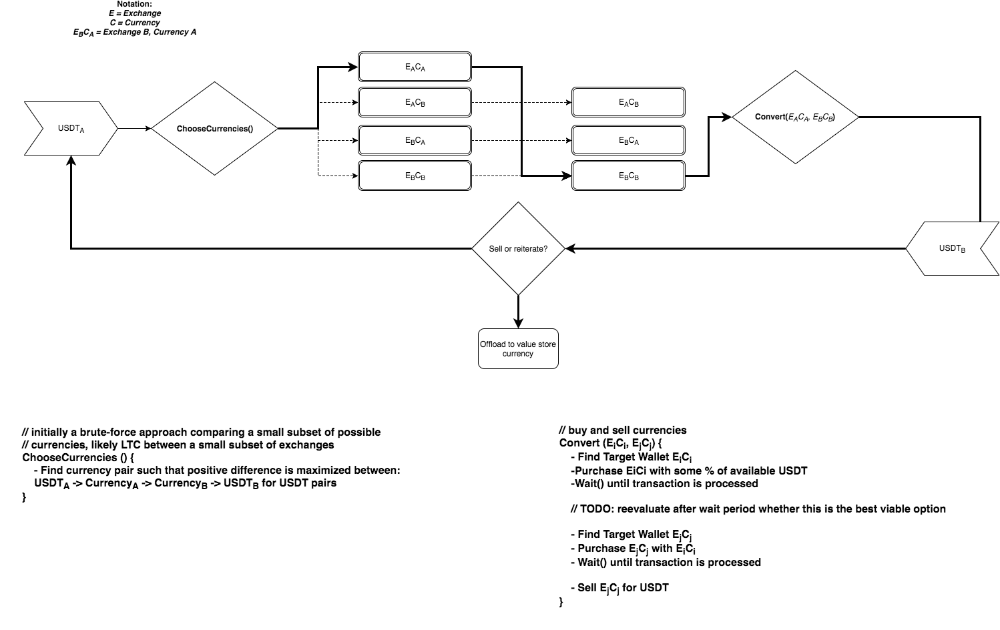

# Cryptocurrency Arbitrage

### Goals:
* 1.0: Iterative Arbitrage trading between exchanges with existing Golang rest client ([Kraken](https://www.kraken.com/help/api), [Bittrex](https://bittrex.com/home/api)) using `USDT` and `LTC`
* 1.1: Write simple rest client for [Poloniex](https://poloniex.com/support/api/) and incorporate into supported exchanges
* 1.2: Add support for 2 more Coins that support sufficiently fast transactions (To be Determined)
* 1.3: Add more exchanges with sufficiently capable APIs
* 1.4: Solve problem: Retrieval of application state persisted outside of the process so money doesn't get lost in random wallets, or just check your balances and schedule a move back to USDT if app failed in the middle of the trade? historical transactions, maybe;
* 1.5: Moar coins, moar exchanges

### Requirements:
* A wallet for _each supported coin_ at _each supported exchange_ persisted somewhere outside the application
* Application state can be persisted outside of the application so that money doesn't get lost in random wallets
* Rest client for each exchange

### Limitations
* Slow transaction times can Ruin Everything
